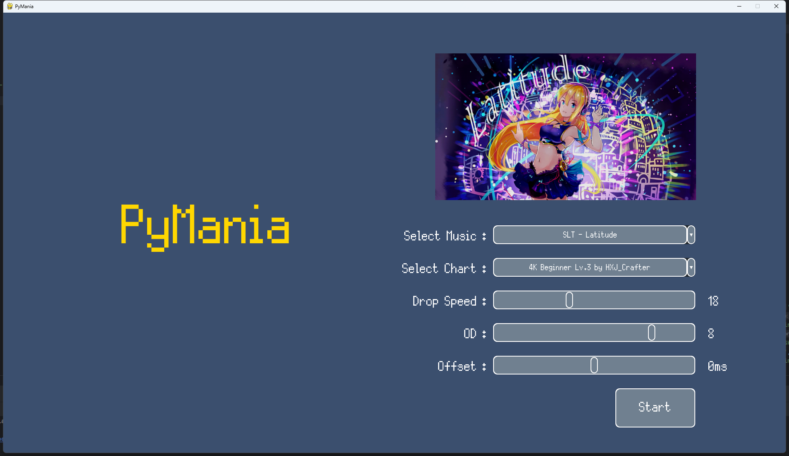

# PyMania

基于pygame-ce开发的像素风**下落式音乐游戏**。判定基于Osu!Mania ScoreV1，可以读取**Malody Key模式**4k-9k谱面进行游玩，可于游戏内自行调节判定难度，下落速度等设置，也可通过config文件调节判定位置，按键颜色，按键大小，设置按键等功能，除字体外无任何额外美术资源。

## 须知

渣代码警告，0优化警告，0错误处理警告，bug警告，随时跑路警告

彩笔python0基础半个月纯自学速成的课程作业，可能未来不会做维护，请窒息。

## 部署方法

1. clone该项目到任意文件夹，注意目录路径不要有中文文件夹

   ```git
   git clone https://github.com/NekoAnlu/Pygame_Mania.git
   ```

2. 安装插件所需模块：`pip install -r requirements.txt`

3. 自行在Malody或点击下载链接下载谱面文件到`./beatmaps`文件夹中

4. 使用powershell在项目根目录文件夹中输入`py run.py`，启动游戏，默认按键映射见下文config设置

**注意本项目使用的是pygame-ce库而不是pygame库，请在步骤2安装模块前提前使用`pip uninstall pygame`卸载pygame库。如在配置本项目前您的电脑上安装了pygame库，可能遇到一些奇怪的报错问题，如遇到报错，请删除pygame和pygame-ce两个库并重新安装pygame-ce库，可能解决问题。**

## Config配置

可以通过修改根目录下`config.cfg`文件实现一些配置，具体如下

```ini
# 配置4-9K的键盘映射绑定，用逗号隔开, space, left shift等需要写全称
[KeyBind]
4k = D,F,J,K
5k = D,F,space,J,K
6K = A,S,D,J,K,L
7k = A,S,D,space,J,K,L
8k = left shift,A,S,D,space,J,K,L,;
9k = A,S,D,F,space,J,K,L,;

# 游戏内皮肤基本设置
[Skin]
# 圆形按键的大小，值为圆的半径
noteSize = 100
# 按键轨道大小，一般比按键大小大10%，请保证值大于圆形按键大小
lineWidth = 120
# 判定线的y轴位置，会直接影响判定位置和判定提示点的位置
hitPosition = 900
# Perfect、great等判定信息的y轴位置
judgementPosition = 500
# Combo的y轴位置
comboPosition = 300
# 按键颜色，仅接受rgb
noteColor = (255,121,174)
# LN长按Body的颜色，仅接受rgb
lnBodyColor = (117,117,120)
```

**没有对设定值做限制，如遇到设定出错请用根目录下`config.cfg.backup`替代以还原默认设置**

## 游玩

1. 按上文运行游戏，可以在主页面看到一些下拉菜单，保证自己的`./beatmaps`有谱面后，可在Select Music下拉菜单选去对应的**歌曲**，选曲后即可在Select Chart下拉菜单中选取这首歌下的所有**谱面**，即为选好关卡，上面的黑框会显示玩家所选谱面歌曲的封面。

2. 可根据自身需求自行调节**下落速度**5 - 40，默认是18。也可以调节判定难度**OD**，和osu!mania的OD一样，数值越高判定越难，默认为OD8。这里的**offset**为谱面延时，可根据自身需求调节。调节完设置后即可点击**Start按钮**开始游戏。

   

3. 按照之前config设置的按键绑定进行游玩，如4K默认为D F J K4个按键，游玩时可以看到自己的判定信息，分数等玩家信息。**（注意游玩时请确保自己没有切换到中文输入法）**

4. 游玩游戏时可随时按下`Esc`暂停游戏，呼出**暂停菜单**，点击对应按钮**重开**或**返回**到标题页面。

   

5. 一首歌结束后会自动跳转到**结算**页面，显示玩家的结算信息，可点击**返回按钮**到标题页面或者点击**重开按钮**重新开始当前歌曲。

## 可能TODO

1. 变速谱支持
1. LN手感优化
1. osu!mania谱面支持
1. 皮肤自定义，目前只有球皮
1. 自定义窗口大小，目前仅为1920x1080

## 已知问题

1. pygame读取音乐为流式加载，在一首歌开头时可能会感觉有一点音频延迟
1. LN绘制导致''卡键''，即按键提示处一直为按下状态
1. 在绘制长LN时会遭遇帧数暴跌

## 第三方资源

**Silver字体**

字体来源出处：https://poppyworks.itch.io/silver

署名4.0国际版（CC BY 4.0）：https://creativecommons.org/licenses/by/4.0/deed.zh

## License

MIT

您可以自由使用本项目的代码用于商业或非商业的用途，但必须附带 MIT 授权协议